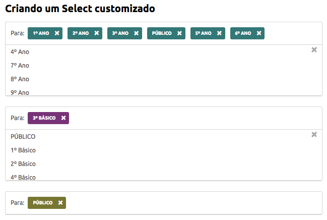

# SelectTag

... precisava de um multiplo select no estilo do Google Plus, para adicionar as Turmas com quem um professor compartilha um determinado post. 

Como Utilizar
-----

1. Adicione a estrutura abaixo.

```
<div id="slc" class="select-option">
    <label for="for-add" class="select-custom select-for no-brd" title="Tags">
        <span class="txt-for">For:</span>
        <div class="for-add">
          <span id="0" class="tag-select public"> PUBLIC <span class="del-tag">+</span> </span>
        </div>
    </label>
    <div id="option-for" class="d-nn box-select">
        
    </div>
</div>
```    

Dependência: Jquery 2.2

Exemplo
-----

[Demo JSFiddle](https://jsfiddle.net/kowal/awy4c7jy/4/)


